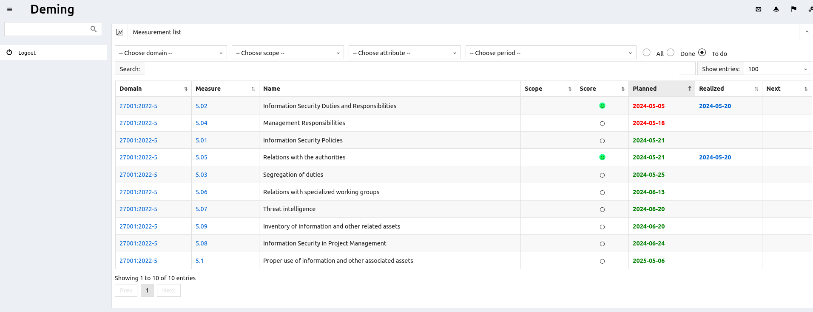
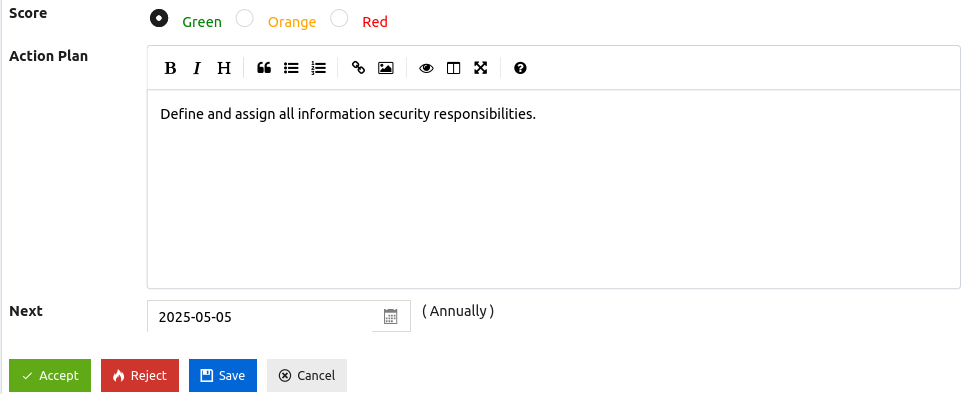

## Delegation

Deming allows you to delegate the realisation of measurements to users who have the *auditee* role.
The auditee role is assigned to a user via the [user management screen](config.md/#users).

This delegation complies with the following rules:

- Auditees are regularly informed by email of the measurements to be carried out;
- Auditees only see the measurements to be carried out and the measurements they have previously carried out;
- Users can accept or reject a measurement performed by an auditee;
- When a measurement is rejected, it returns to the list of measurements to be carried out by the auditee.

### List of measurements to be performed

From the auditee's point of view, the application's main page contains the list of measurements that are assigned to him.

Tha auditee can :

- Search the list of measurements
- Filter measurements by domain, scope, attribute or period.
- Sort the list by each column
- Select a measurement to perform

### Performing an measurement

When an auditee performs an mesurement, they can :

- "Save" the measurement

- "Make" the mesurement

[{: style="width:300px"}](images/d2.png)

When the auditee clicks on :

- "Save", the changes made are saved and the measurement remains in the list of measurements to be performed

- "Make", the changes made are saved and the measurement changes to the status to be validated. From the auditee's point of view, the measurement is in the list of measurements performed.

- If the auditee selects "Cancel", the changes are not saved and the auditee returns to the measuremet view.

### Accepting / Rejecting a measurement

Once an measurement has been carried out by an auditee, it changes status to "to be validated".

For other users, this is shown by an hourglass next to the completion date in the list of checks to be carried out:

When the user clicks on the date next to the hourglass, they are taken to the measurement performed by the auditee.

They can then accept or reject the measurement, adding a note in the measurement observations and, depending on the measurement score, propose an action plan and anmeasurement review date.

[{: style="width:500px"}](images/d4.png)

If the user clicks on :

- "Accept": the modified data is saved and a new measurement is created on the planning date entered.

- "Reject": the modified data is saved and the measurement is returned to the auditee list of controls to be performed.

- "Save": the data is saved and the user returns to the measurement view.

- "Cancel": the user returns to the measurement view.
